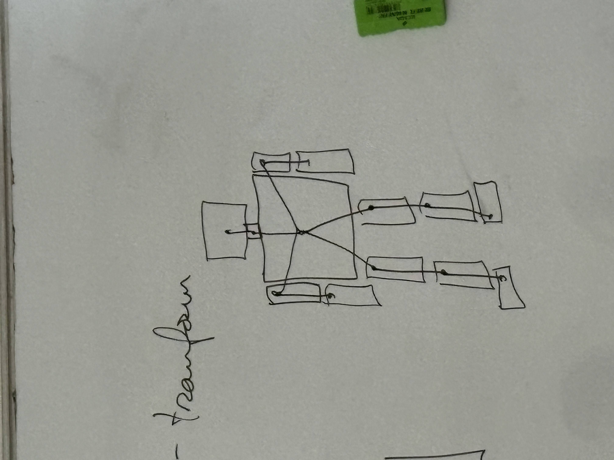

# Lecture 8 - Scene graph

$$
pos: P = (x, y, z) \\
rot - (w, x, y, z) \\

% matrix:
R = \begin{bmatrix}
i_x & i_y & i_z \\
j_x & j_y & j_z \\
k_x & k_y & k_z
\end{bmatrix} \\

P, R \rightarrow
\begin{bmatrix}
 & & & \\
 & R & & P \\
 & & & \\
0 & 0 & 0 & 1
\end{bmatrix} \\

$$


## For the social anxiety project:
1. make a robot out of boxes - hierarchy of boxes


2. make it walk realistically

```
while (1) {
    update scene    - read sensors
                    - modify scene
    render
}
```

### Recap - useful infos
- transform
- hierarchy


### Steps
- universal 3d
- can use unity version control - unity projects are huge

### Useful stuff:
- don't inherit scaling
- use proximal joints
